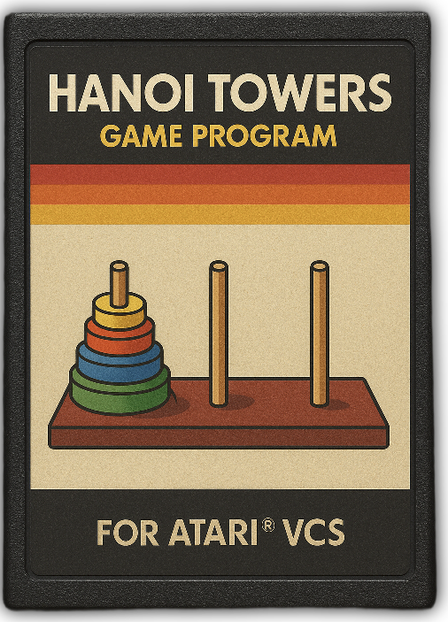

<h1 style="color:#fc0;">Hanoi Towers</h1>

  
(Eng. below)

&#9679; Oyun, 1800'lerin son çeyreğinde Fransız Matematikçi Édouard Lucas tarafından keşfedilmiş olup bir çok farklı isimle anılmış, farklı versiyonları çıkmıştır. Amaç, en sol kuledeki, sayısı kullanıcı tarafından belirlenecek olan diskleri en sağdaki kuleye taşımaktır. Alınan herhangi bir disk, kendisinden küçük olanın üzerine konamaz. Kule ya boş olmalıdır, ya da mutlaka kendinden büyük bir diskin üzerine konulmalıdır. Tüm diskler birer birer taşınmalıdır.

&#9679; Top-level-statement ile kurulan kod, gereksiz ayrıntıların dışarıda bırakılmasını sağlar. Diskler ve kuleler için ise stack yapısını kullanır.

&#9679; Konsol/Terminal sınırları gereği 7 diske kadar kullandım. Giriş ekranında 3-7 arası bir rakam girilerek farklı disk sayısı ile başlanabilir. Bu sınırlar dışındaki oyun standart olarak 5 disk ile başlayacaktır.

&#9679; Kodun tamamı olabildiğince temiz ve yorumlanarak yazılmıştır.

&#9679; Kaset görüntüsü AI ile oluşturulmuştur. ATARI® tescilli bir markadır ve ATARI Interactive, Inc.’e aittir.

Serkan SARP @ 2025 / Ankara 
<a href="http://www.serkansarp.com" style="color: yellow; text-decoration: none;">serkansarp.com</a> 
<a href="https://www.github.com/serkansarp" style="color: yellow; text-decoration: none;">github.com/serkansarp</a> 
<a href="https://www.linkedin.com/in/serkansarp" style="color: yellow; text-decoration: none;">linkedin.com/in/serkansarp</a>

---
 
&#9679; The game was discovered in the late 1800s by French mathematician Édouard Lucas and has been known by many different names, with various versions released over time. The objective is to move the disks, whose number is determined by the user, from the leftmost tower to the rightmost tower. Any disk can only be placed on top of a disk that is larger than itself or on an empty tower. All disks must be moved one by one.

&#9679; Using top-level statements allows the code to remain concise by keeping unnecessary details out. Stacks are used to represent the disks and towers.

&#9679; Due to console/terminal limitations, the game supports up to 7 disks. On the input screen, the user can start with 3–7 disks. Any number outside this range will default to 5 disks.

&#9679; The code is written as cleanly as possible and fully commented.

&#9679; The cassette image was generated using AI. ATARI® is a registered trademark of ATARI Interactive, Inc.

Serkan SARP @ 2025 / Ankara 
<a href="http://www.serkansarp.com" style="color: yellow; text-decoration: none;">serkansarp.com</a> 
<a href="https://www.github.com/serkansarp" style="color: yellow; text-decoration: none;">github.com/serkansarp</a> 
<a href="https://www.linkedin.com/in/serkansarp" style="color: yellow; text-decoration: none;">linkedin.com/in/serkansarp</a>

